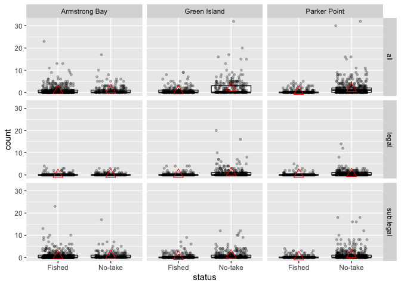

BIOL4408 Marine Ecology: Lobster density 3.
================
TimLanglois
09/01/2020

## 3\. Basic plots to check the data

Load extra librarys

``` r
library(tidyr) #to tidy data
library(dplyr) #to transform data
library(readr) #to write data
library(here) #to make robust links to files

library(forcats) #to transform catagorical data
library(ggplot2) #to plot data
```

Set a study name

``` r
study<-"lobster.density"
```

Use here() to make a shortcut to the “Data” directory.

``` r
data.dir <- here("Analysis_Lobster_density","Data")
```

Read in the data and glimpse the data. glimpse() shows the variable
names, formats, head of the data.

I have also shown you the message from read\_csv() - which alerts you to
the format that each column of the data was read in as. The format is
decided by read\_csv() previewing the first 1000 rows of data.

This is very important to check and you can also use this column
specification to stipluate/force the formatting of each column as the
data is read in by the function.

``` r
setwd(data.dir)#this is out shortcut using here()
dir()
```

    ## [1] "dat.csv"                    "lobster.density.csv"       
    ## [3] "lobster.density.gsheet.csv" "status.barplot.png"        
    ## [5] "status.year.sanctuary.png"

``` r
dat<-read_csv("lobster.density.csv")%>%
  glimpse()
```

    ## Parsed with column specification:
    ## cols(
    ##   sample.no = col_double(),
    ##   year = col_double(),
    ##   date = col_datetime(format = ""),
    ##   sanctuary = col_character(),
    ##   status = col_character(),
    ##   site.new = col_character(),
    ##   complexity = col_double(),
    ##   algal.cover = col_double(),
    ##   size.class = col_character(),
    ##   count = col_double()
    ## )

    ## Observations: 6,402
    ## Variables: 10
    ## $ sample.no   <dbl> 1, 2, 3, 4, 5, 6, 7, 8, 9, 10, 11, 12, 13, 14, 15, 16, 17…
    ## $ year        <dbl> 2014, 2014, 2014, 2014, 2014, 2014, 2014, 2014, 2014, 201…
    ## $ date        <dttm> 2014-01-26 16:00:00, 2014-01-26 16:00:00, 2014-01-26 16:…
    ## $ sanctuary   <chr> "Armstrong Bay", "Armstrong Bay", "Armstrong Bay", "Armst…
    ## $ status      <chr> "No-take", "No-take", "No-take", "No-take", "No-take", "N…
    ## $ site.new    <chr> "Little Armstrong.No-take", "Little Armstrong.No-take", "…
    ## $ complexity  <dbl> 0, 2, 4, 1, 4, 2, 2, 2, 2, 1, 3, 1, 1, 2, 1, 3, 1, 2, 2, …
    ## $ algal.cover <dbl> 3, 3, 3, 3, 2, 2, 2, 2, 2, 2, 2, 3, 3, 3, 3, 3, 3, 2, 2, …
    ## $ size.class  <chr> "legal", "legal", "legal", "legal", "legal", "legal", "le…
    ## $ count       <dbl> 0, 0, 0, 0, 0, 0, 0, 0, 0, 0, 0, 0, 1, 0, 0, 0, 0, 0, 0, …

## Basic plots to check out the data

Scatterplot

``` r
ggplot(data=dat, aes(x=status, y=count)) + 
  geom_point()
```

<!-- -->

Scatterplot with jitter and alpha (great for checking data)

``` r
ggplot(dat, aes(x=status, y=count)) + 
  geom_point(position = position_jitter(),alpha = 1/4) #alpha gives transparency
```

<!-- -->

Scatterplot with jitter and alpha and with one factor facetted

``` r
ggplot(dat, aes(x=status, y=count)) + 
  geom_point(position = position_jitter(),alpha = 1/4)+
  facet_grid(.~year) #facet by factor
```

<!-- -->

Scatterplot with jitter and alpha and with two factors facetted

``` r
ggplot(dat, aes(x=status, y=count, colour=status)) + 
  geom_point(position = position_jitter(width = 0.1, h = 0),alpha = 1/4)+
  facet_grid(size.class~year)
```

<!-- -->

Boxplot with facet by two factors with outliers

``` r
ggplot(dat, aes(x=status, y=count)) + 
  geom_boxplot()+
  facet_grid(size.class~sanctuary)
```

<!-- -->

Boxplot with facet by two factors without outliers

``` r
ggplot(dat, aes(x=status, y=count)) + 
  geom_boxplot(outlier.shape = NA)+
  facet_grid(size.class~sanctuary)
```

<!-- -->

Box plots provide a summary of your data: - median (Q2/50th Percentile):
the middle value of the dataset. - first quartile (Q1/25th Percentile):
the middle number between the smallest number (not the “minimum”) and
the median of the dataset. - third quartile (Q3/75th Percentile): the
middle value between the median and the highest value (not the
“maximum”) of the dataset. - interquartile range (IQR): 25th to the
75th percentile. - “maximum” whisker: Q3 + 1.5*IQR - “minimum” whisker:
Q1 -1.5*IQR - outliers

Boxplots are useful to tell you about your outliers and what their
values are. They can also tell you if your data is symmetrical, how
tightly your data is grouped, and if and how your data is skewed.

Our lobster data is heavily skewed to zero values. Box plots are not so
useful to display such data, but it is important for us to see this
zero-richness and think about how it may influence our data analysis.

Boxplots also do not indicate where the mean is. Given that most
statistical tests are comparing means - we should add a mean to see
where it is.

Boxplot with facet by two factors, scatterplot with alpha and mean.

``` r
ggplot(dat, aes(x=status, y=count)) + 
  geom_boxplot(outlier.shape = NA)+
  geom_point(position = position_jitter(width = 0.3, h = 0),alpha = 1/4, size=1)+
  stat_summary(fun.y=mean, geom="point", shape=2, size=4, colour="red")+ #adds mean
  facet_grid(size.class~sanctuary)
```

<!-- -->

The means are close to zero\! We will make some alternative plots,
better suited to showing zeros in the next scripts.

Boxplots are not good for displaying count data, especially zero-rich
count data. Boxplots are much better suited to display continous
environmental data such as out estimates of complexity. Are complexity
data is only semi-continous and really ordered categorical data, but the
boxplot can show us the patterns in this data well.

``` r
ggplot(dat, aes(x=status, y=complexity)) + 
  geom_boxplot(outlier.shape = NA)+
  geom_point(position = position_jitter(width = 0.3, h = 0),alpha = 1/4, size=1)+
  stat_summary(fun.y=mean, geom="point", shape=2, size=4, colour="red")+ #adds mean
  facet_grid(size.class~sanctuary)
```

<!-- -->
